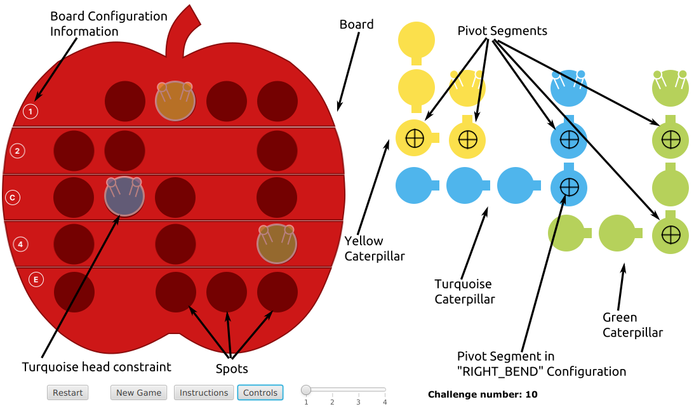
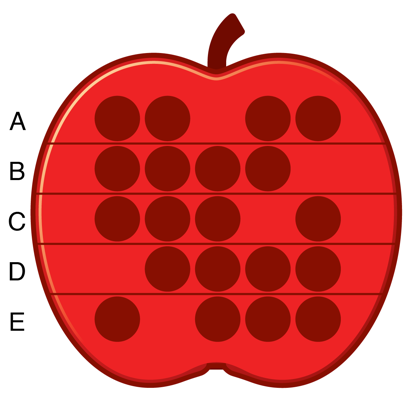
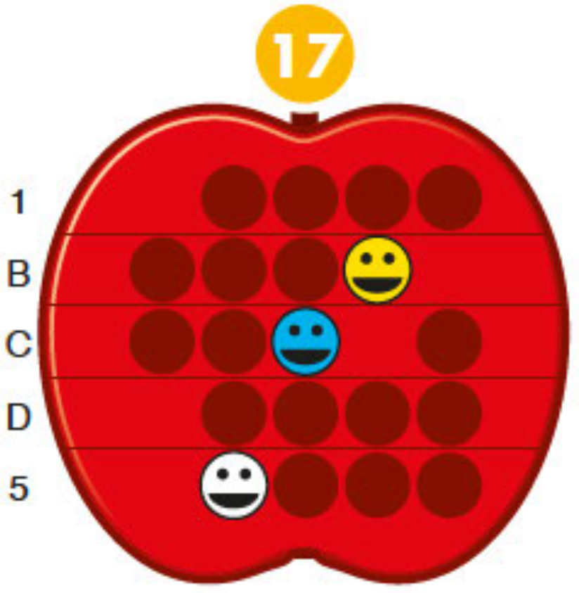

# COMP1110 Assignment 1

## Academic Honesty and Integrity

Honesty and integrity are of utmost importance. These goals are *not* at odds
with being resourceful and working collaboratively. You *should* be resourceful
and you may discuss the assignment
and other aspects of the course with others taking the class. However, the golden
rule is simple: **you must never misrepresent the work of others as your own**.

If you have taken ideas from
elsewhere or used code sourced from elsewhere, you must say so with *utmost
clarity*. You are asked to submit a statement
of originality. This statement is the place
for you to declare which ideas or code contained in your submission were sourced
from elsewhere.

Please read the ANU's [official position](http://academichonesty.anu.edu.au/) on
academic honesty. If you have any questions, please ask me.

Carefully review the [statement of originality](originality.yml) which you must
complete.  Edit that statement and update it as you complete the assignment,
ensuring that when you complete the assignment, a truthful statement is
committed and pushed to your repo.

## Purpose

This assignment is introductory, helping you gain familiarity with the basics
of Java, but doing so in the context of slightly larger piece of code.  Most of
the assignment is composed of a series of small tasks.

## Assignment Deliverable

The assignment is worth 5% of your total assessment, and it will be marked out
of 5. However, these marks are [redeemable](https://cs.anu.edu.au/courses/comp1110/assessments/redeemable/) by the exam,
so if your exam mark / 20 is higher than your assignment one mark, you will get the exam mark / 20 rather
than the assignment one mark. **The mark breakdown is described on the
[deliverables](https://cs.anu.edu.au/courses/comp1110/assessments/deliverables/#D1A) page.**

<!-- The assignment is due at **TIME HERE**, **DATE HERE**, giving you **NUMBER OF WEEKS HERE** weeks in which to complete it. -->  
You can find [the deadline](https://cs.anu.edu.au/courses/comp1110/assessments/deliverables/#D1A)
on the [deliverables page](https://cs.anu.edu.au/courses/comp1110/assessments/deliverables/), where all assignment deadlines for this semester are
listed.
Your tutor will mark your assignment by accessing your GitLab repository, so it is essential that you carefully follow
instructions for setting up and maintaining your repository. You will be marked
according to **whatever is committed to your repository at the time of the deadline**.
Since the first assignment is redeemable, [**late extensions
are not offered and will not be given**](https://comp.anu.edu.au/courses/comp1110/policies/#deadlines). As always, throughout the course, if
some significant circumstance arises outside of the course that affects your capacity to complete the course, please
carefully follow the ANU's [special consideration process](http://www.anu.edu.au/students/program-administration/assessments-exams/special-assessment-consideration), and your circumstances will be accounted for in your final
assessment.

## Overview
<!-- game pieces, objectives -->
The assignment is based on a simple children's puzzle called [Apple Twist](https://www.smartgames.eu/uk/one-player-games/apple-twist),
made by [SmartGames](http://www.smartgames.eu/), a producer of educational games. The design of the game and all imagery in this assignment comes from their Apple Twist game.

{height=500px}

**Figure 1: Apple Twist product photo**

The game comes with 60 pre-defined challenges, organised into 4 difficulty levels from starter to master. Each challenge defines the board configuration, and some clues about where the caterpillars go.

 The general objective of the game is to fit in all the caterpillars in the board by bending them as necessary.
 
We provide you with a paper version of the game (see assets folder), which you can print out to help you visualise the game if you wish.

## Rules and terminology
<!-- rules of the game -->

Note: the following is adapted from the apple twist challenge book. 

The apple game board is divided into 5 horizontal sections (called Row Templates in our implementation) that can each be flipped as required by each challenge (see first image in README). 
- The frontside sections are indicated by numbers 1-5
- The backside sections indicated by letters A-E

The game includes a green caterpillar with six segments, a yellow caterpillar with 5 segments and a turquoise (blue) caterpillar with 6 segments. The goal is to place all three caterpillars on the apple board. Each caterpillar can be bent in different places along it's length - in this assignment we call these places "Pivots". All parts of the caterpillar must fit inside the dimples of the apple (in this assignment called "Spots" - see Figure 2). No part of the caterpillar can sit on a flat part of the apple. 

#### Challenges 
A challenge (see Figure 4 example) includes the information on which board sections are facing up. Challenges also include constraints / requirements about the position that caterpillar heads must go, but NEVER which direction the heads must be facing.

- A white caterpillar head is the equivalent of a 'wildcard' (see Figure 4 below) and indicates that any one of the three caterpillar's heads must be placed in that position. 

- Often a few of the board Spots will remain empty when completing a challenge. 

- There are 60 challenges in the challenge booklet (for example see Figure 4 below).

- There is only one solution to each challenge!

## Your Task

This repository contains a java implementation of Apple Twist,
including a graphical user interface (GUI).
Unfortunately this version of the game has some parts missing.
While the graphical user interface is complete, some of the important
game logic is missing, so it won't work as described above. It is your task
to fix the problems. Each specific subtask is (a) listed as an issue in
the issue tracker in this repository and (b) identified by a `FIXME`
comment in the source code. You should not change other parts of the
code than those indicated; however, feel free to add additional "helper"
methods to the classes if you like. When all tasks are completed, the game will
function correctly. Check your changes by using the provided unit tests.

The rest of this README file describes the components of the game, and
how they are represented in the assignment, in more detail.

### Board

The board is defined as a 5 x 5 grid with some spots missing (see Figure 2). Below is a depiction of the board, along with each position's Cartesian coordinates:

|     |     |     |     |     |     |     |
| --- | --- | --- | --- | --- | --- | --- |
|     | x   | 0   | 1   | 2   | 3   | 4   |
| y   |     |     |     |     |     |     |
| 0   |     | (0,0) | (1,0) | (2,0) | (3,0) | (4,0) |
| 1   |     | (0,1) | (1,1) | (2,1) | (3,1) | (4,1) |
| 2   |     | (0,2) | (1,2) | (2,2) | (3,2) | (4,2) |
| 3   |     | (0,3) | (1,3) | (2,3) | (3,3) | (4,3) |
| 4   |     | (0,4) | (1,4) | (2,4) | (3,4) | (4,4) |

A place where a caterpillar segment can occupy is called a ``Spot`` (see Figure 2). Note that not all board coordinate positions in the 5 x 5 grid contain a ``Spot``. For any given challenge different positions contain a ``Spot``.

### Caterpillars 
Each ``Caterpillar`` is made up of segments (see ``Segment`` class), some segments can pivot (see Figure 2). Segments that can pivot can either have a ``LEFT_BEND``, ``RIGHT_BEND`` or be``STRAIGHT`` (see enum ``PIVOT`` in ``Segment`` enum class). 
Note: the reference for `LEFT_BEND` and `RIGHT_BEND` is starting at the head and looking towards the tail of the caterpillar, so the apparent bend direction in the GUI will
depend on the orientation of the caterpillar head.

{height=500px}

**Figure 2: Labelled game screenshot**

Each caterpillar has a defined head direction of ``UP``, ``DOWN``, ``RIGHT`` or ``LEFT`` (see ``Direction`` class). 

Like direction, the position of the Caterpillars are defined relative to the position of their head (``headPosition`` in ``Caterpillar`` class). Note that unlike the caterpillar head direction, the head position  is only defined for when the caterpillar is located on the board. 

The ``getPositions(Position virtualHead)`` method (see Task #7) in the ``Caterpillar`` class provides the integer positions of each ``Segment`` in a given ``Caterpillar`` object, relative to a provided "virtual head" position.
Until you implement this method (and all previous tasks), the provided graphic user interface will have limited functionality.

## Encoding the Game
This section explains how certain elements of the game are encoded into
strings. While such an encoding is not necessary for designing software using
object orientation, the encoding and decoding used in this assignment will be
very similar to the work you will be doing in Assignment 2.

### Initial State
The initial state of a challenge describes the configuration of the board and some constraints / requirements about where to put the caterpillar heads. It is encoded as **five** letters and or numbers of the **board configuration** concatenated with up to **three** sets of **caterpillar head requirements**. 

Note: for the following sections notation ``[A|B]`` denotes a string: "A" or "B".

#### Board configuration
The board configuration describes which **side** of each row of the board (red apple) is face up and is comprised of the following:

``[A|1][B|2][C|3][D|4][E|5][F|6]``

For example, the encoded board configuration "ABCDE" is shown in the image below:

{height=500px}

**Figure 3: Example board configuration**

#### Caterpillar head requirements
Each caterpillar head constraint is encoded as a letter representing the colour of the caterpillar (``[G|T|Y|X]`` for Green, Turqoise, Yelllow and Wildcard) followed by the x then y axis coordinate for that head constraint. For example, "T22" means that position(2,2) is constrained to be the head of the Turqoise caterpillar (see Figure 4). 

Each challenge includes from zero up to three concatenated head constraints, for example "T22Y31X14" is the encoded head constraints string for Challenge 17 - see image below:

{height=500px}

**Figure 4: Challenge 17 with "1BCD5T22Y31X14" string encoding**

#### Overall challenge string encoding 
The challenges are encoded by concatenating the board configuration and head requirements encoding. For example the encoding for challenge 17 in Figure 4 above has a string encoding of "1BCD5T22Y31X14". 

## Legal and Ethical Issues

First, as with any work you do, you must abide by the principles of
[honesty and integrity](https://comp.anu.edu.au/courses/comp1110/policies/#academic-integrity).
I expect you to demonstrate honesty and integrity in everything you do.

In addition to those ground rules, you are to follow the rules one
would normally be subject to in a commercial setting. In particular,
you may make use of the works of others under two fundamental
conditions: a) your use of their work must be clearly acknowledged,
and b) your use of their work must be legal (for example, consistent
with any copyright and licensing that applies to the given material).
**Please understand that violation of these rules is a very serious
offence**. However, as long as you abide by these rules, you are
explicitly invited to conduct research and make use of a variety of
sources. You are also given an explicit means with which to declare
your use of other sources (via originality statements you must
complete). It is important to realize that you will be assessed on the
basis of your original contributions to the project. While you won't
be penalized for correctly attributed use of others' ideas, the work
of others will not be considered as part of your
contribution. Therefore, these rules allow you to copy another
student's work entirely if: a) they gave you permission to do so, and
b) you acknowledged that you had done so. Notice, however, that if you
were to do this you would have no original contribution and so would
receive no marks for the assignment (but you would not have broken any
rules either).

## Evaluation Criteria
The mark breakdown / evaluation criteria are described on the
**[deliverables page](https://comp.anu.edu.au/courses/comp1110/assessments/deliverables/#D1A)**.

As part of fulfilling the requirements outlined on the deliverables page,
your job is to complete tasks #1 to #9 which are provided as gitlab issues.
Task #1 is setup, Task #10 is and extension, neither are marked.

The tasks in the following categories are marked:

**Easy**

- Tasks #2, #3, #4

**Moderate**

- Task #5, #6, #7

**Challenging**

- Task #8 and #9 

**IMPORTANT NOTE:** *Recall that the assignment is redeemable against the final exam so
don't stress if you are new to programming and not able to complete all the tasks at this
stage.*

